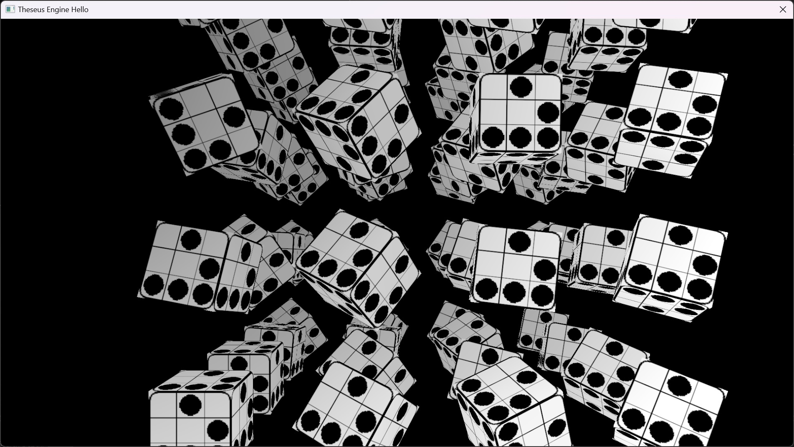

# theseus
Theseus Game Engine

Author: [Timo Wirén](https://twiren.kapsi.fi)

This will become the successor to [Aether3D engine](https://github.com/bioglaze/aether3d).

# Features

  - Modern Vulkan 1.3 and Metal 3 renderers
  - Fast compile times
  - Loads .tga and .dds textures
  - OBJ mesh converter
  - Shader hot-reloadingg
  
# Platforms

  - Windows (VS 2022 project files included)
  - macOS/iOS
  - Linux support (requires Wayland)

# Building

  - macOS:
    - build theseus.xcodeproj and copy the resulting framework to src/samples/hello_mac_ios
    - build and run hello_mac_ios/hello.xcodeproj

  - Linux:
    - src/Makefile can be used to compile the engine. Build results are copied to theseus/build.
    
